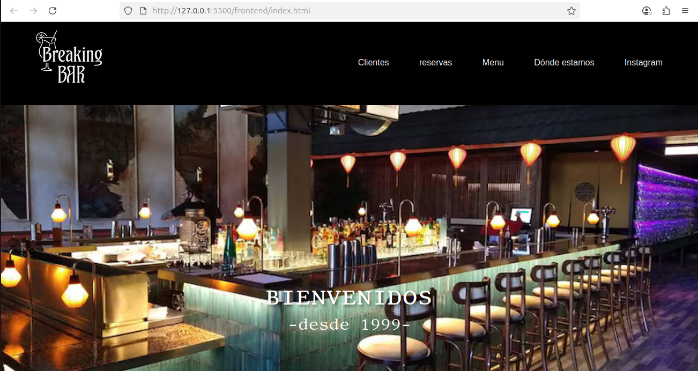
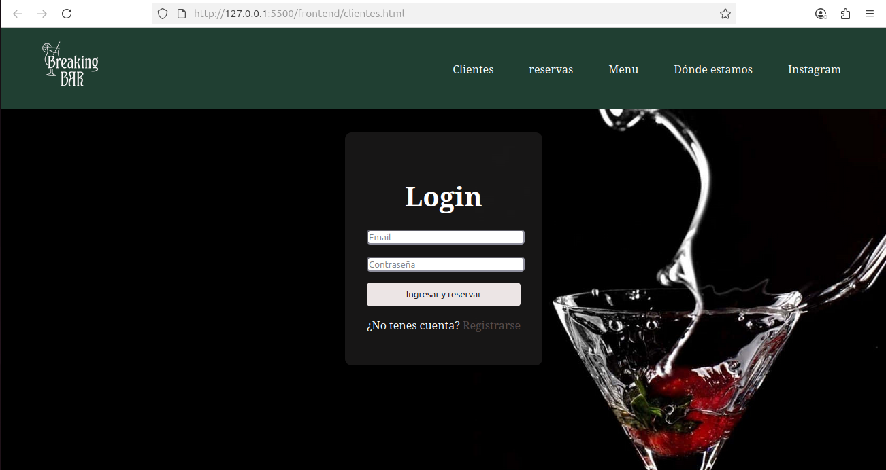
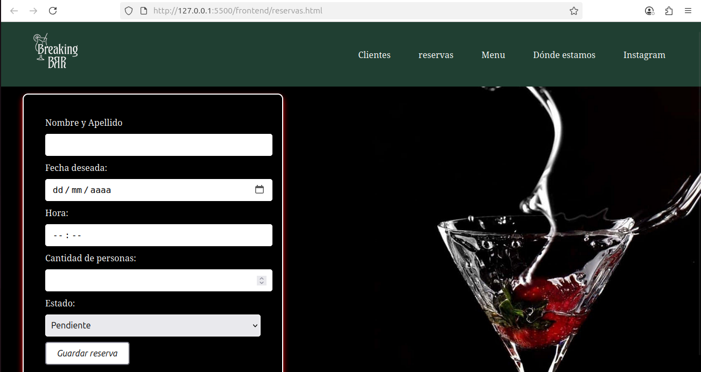
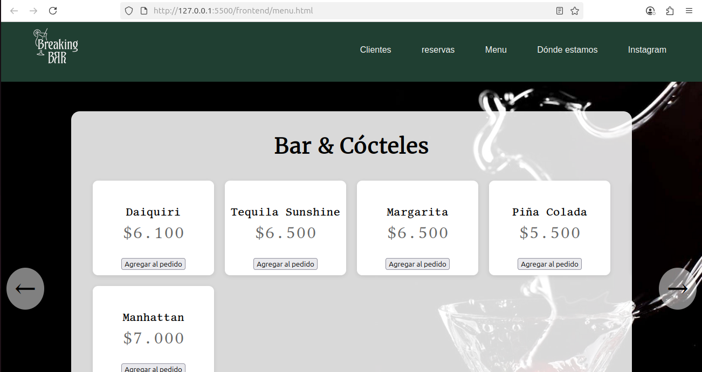

<<<<<<< HEAD
# proyecto-final
=======
# Breaking BAR 🍸 (sitio web de bar para reservas de mesa)

Bienvenidos a **Breaking BAR**, una aplicación web pensada para gestionar las reservas, el menú y el registro de clientes de un bar.  
Este proyecto está desarrollado con **Node.js, Express, HTML, CSS, JavaScript y PostgreSQL** como base de datos.

---

## 🌐 Funcionalidades principales


La app está compuesta por tres módulos principales que permiten realizar operaciones **CRUD (Crear, Leer, Actualizar y Eliminar)**:

### 1. 👤 Clientes (`/clientes`)


- Registro de nuevos clientes.
- Inicio de sesión.
- Datos guardados en la tabla `clientes`.

### 2. 📅 Reservas (`/reservas`)


- Permite a los clientes crear nuevas reservas.
- Listado de reservas del cliente autenticado.
- Edición y cancelación de reservas.
- Ruta protegida: solo se puede acceder si el cliente está logueado.

### 3. 🍽️ Menú (`/menu`)


- Visualización del menú del bar.
- permite visualizar si el cliente registrado tiene productos comprados.
- Los productos incluyen nombre, descripción, precio y si esta disponible.
---

***Se puede encontrar la estructura de la base de datos en el archivo:***
```
./backend/scripts/db.sql
```
## 🛠️ Instalacion:
Par levantar el backend correr:
```
make run-backend
```
Si solo se quiere levantar la base de datos:
```
make start-db
```
### Correr en local:
sigue los siguientes pasos:

**En la terminal:** 
```
git clone https://github.com/MaximaSol17/proyecto-final 
cd proyecto-final
```

**Luego ejecutar:** 
```
docker compose up --build  
```
Este ultimo comando levantará tanto la base de datos, como el backend y el frontend

---
## ✍️ Integrantes
Sofía Aylen Lopez 112613 \
Máxima de Crescenzo 114024 \
Julian Baxendale 113804


>>>>>>> prueba-1

